# How to use Eclipse with GitHub

This is a tutorial on how to use Eclipse with GitHub.

> [!NOTE]  
> I've created this repository/tutorial a few years ago.
> Although it shows a valid way to use Eclipse with GitHub, I would always prefer an external Git client (e.g., [GitKraken](https://www.gitkraken.com/)) these days.

## Requirements

The latest version of Eclipse can be downloaded from [here](https://www.eclipse.org/downloads/) and of course a [GitHub account](https://github.com) is needed.

## First Step: Install EGit in Eclipse

For uploading code from Eclipse, the `egit-plugin` is needed. 
  
* In Eclipse, go to **Help/Install new Software...**.
* Paste `http://download.eclipse.org/egit/updates` in **Work with:** and click **Add**.
* Select all of the options and click **Next**.
* Accept all of the license agreements and finish the installation.

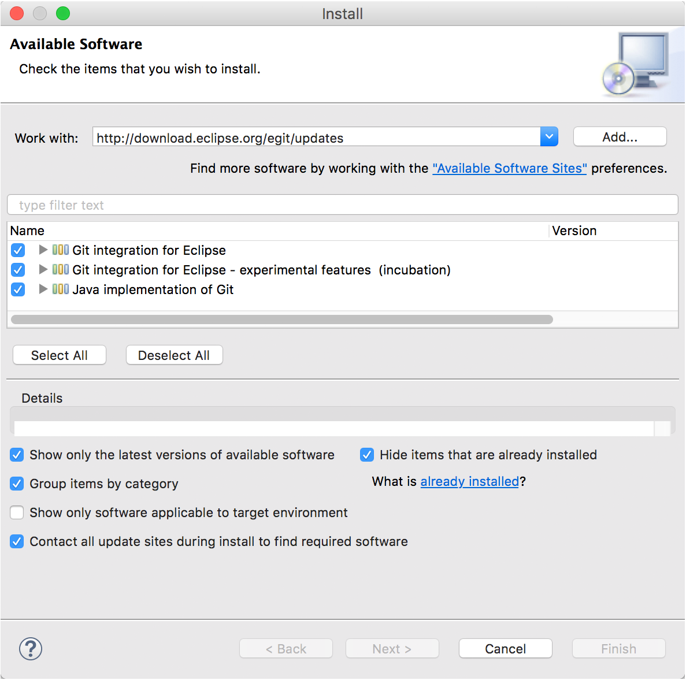  

## Create a public DSA key in Eclipse

For the authentification with GitHub, it is neccessary to create a secure key which is known by the local Eclipse installation and the GitHub service.  

* In Eclipse, go to **Preferences/General/Network Connections/SSH2**.
* Select **Key Management**.
* Click on **Generate DSA Key...**.

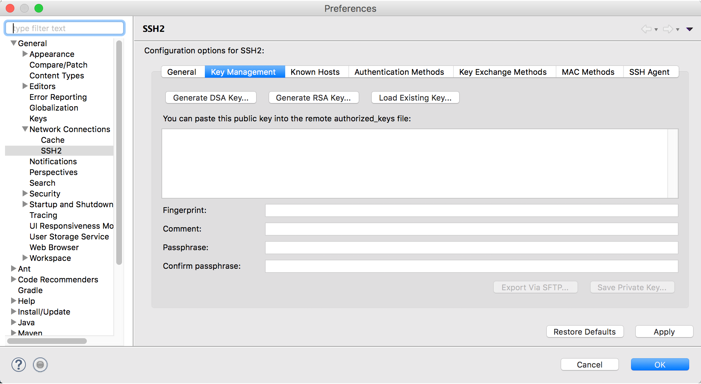

* At the bottom of the window, type in a secret passphrase.
* Click on **Save Private Key...** and save the file at a well known location.

## Register your DSA key with GitHub

* Open your previous generated file with a text editor (e.g., Notepad or SublimeText) and copy the whole text to your clipboard (**CTRL+C/CMD+C**).
* On the GitHub page go to your **Settings/SSH and GPG keys**.
* Click on **New SSH key**.
* Select a title of your choice and paste the previous copied text from your clipboard into the **Key** field (**CTRL+V/CMD+V**).
* Click on **Add SSH key**.

## Create a new repository on GitHub

* On GitHub click on **New repository** and give the new repository a name.
* Do ***not*** select the option **Initialize this repository with a README**.
* Click on **Create repository**.

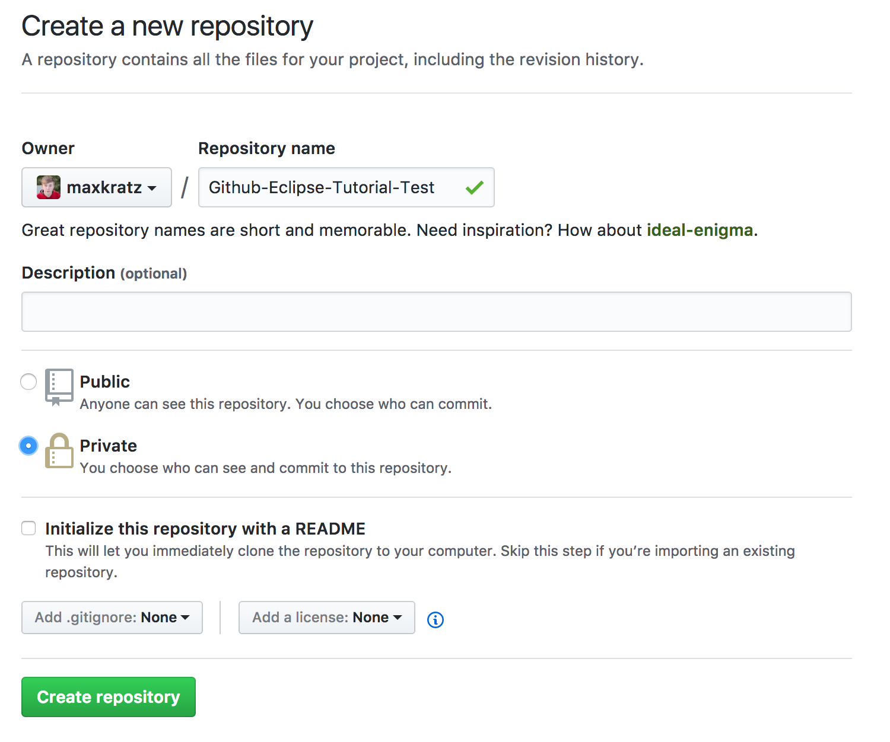

## Import the GitHub repository in Eclipse

* In Eclipse, go to **Window/Show View/Other...**.
* Select **Git/Git Repositories**.
* A new view should appear.
* Click on **Clone a Git repository**.
* Paste your repository URL from GitHub in the URL field (be sure to copy the ssh URL from the repository page on GitHub with something like **git@github.com** at the beginnig).

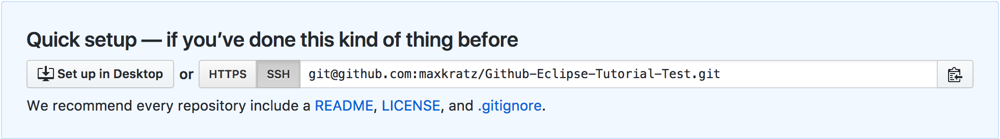  

* Select `ssh` as **Protocol**.
* Click **Next** (there is no authentification needed).

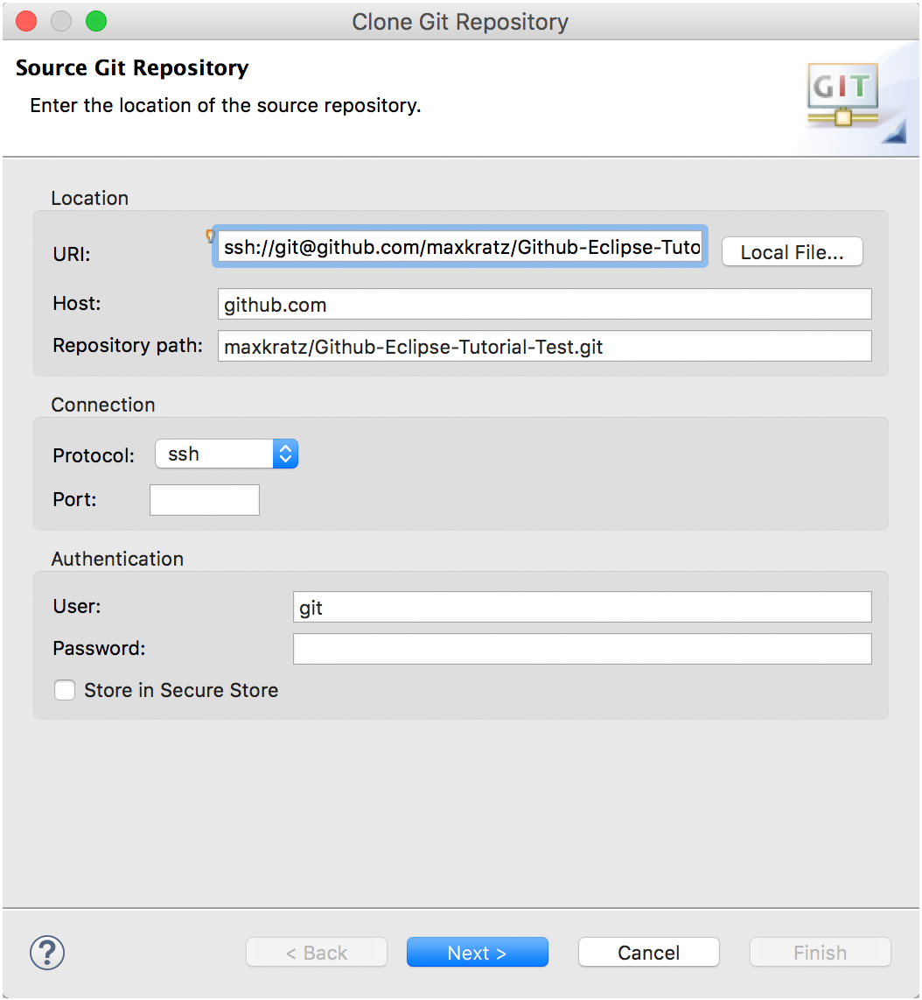  

* Click **Next** again.
* Click **Finish**.
* When you close the message of the Git repository from GitHub, you should define a repository location (e.g., in your home folder on your system) if Eclipse prompts you to do so.
* You should now have a Git view of your repositories (probably just one).

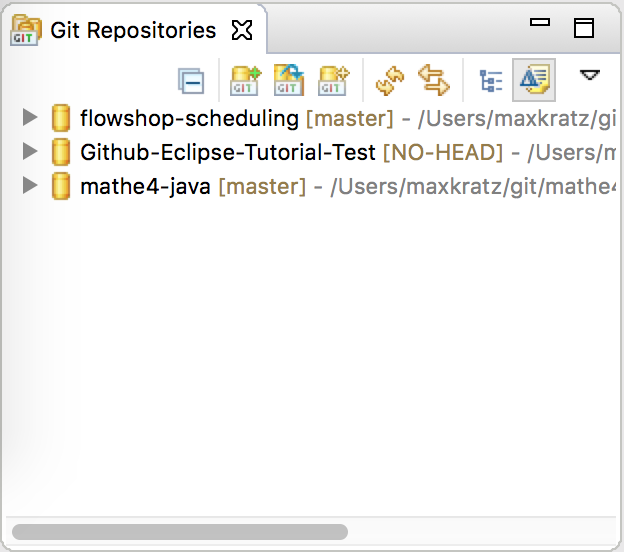

## Link Eclipse projects with your repository

You have to link your Eclipse projects with your GitHub repository to push data to GitHub.   

* Right click on your project **Team/Share Project...**.
* Select your repository and click **Finish**.

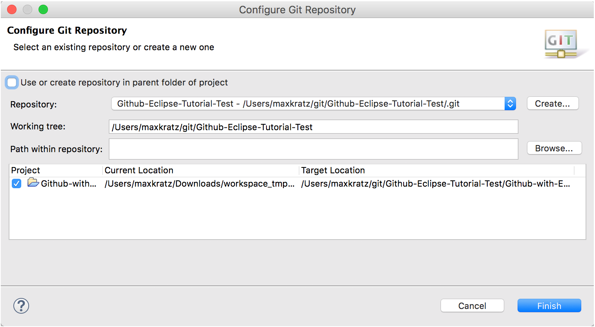

## Upload source files to GitHub

* Click on your repository (in the repository-view).
* Drag all entries from the field **Unstaged Changes(n)** to the field **Staged Changes(m)**.
* Write a nice **Commit Message** like *This is my first commit*.
* Click **Commit and Push...**.

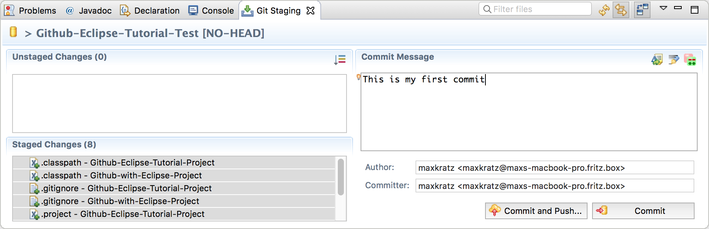  

* Click **Next**.

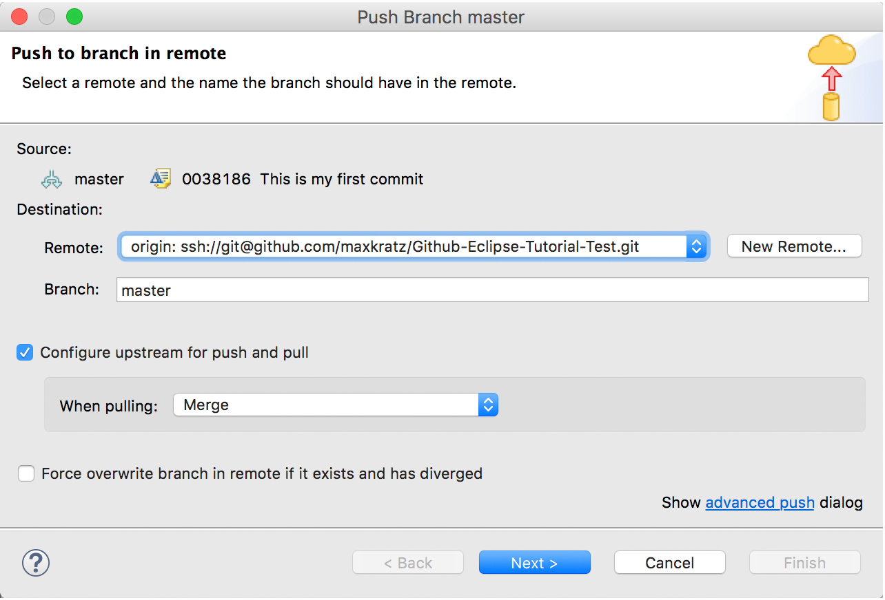 

* Click **Finish**.

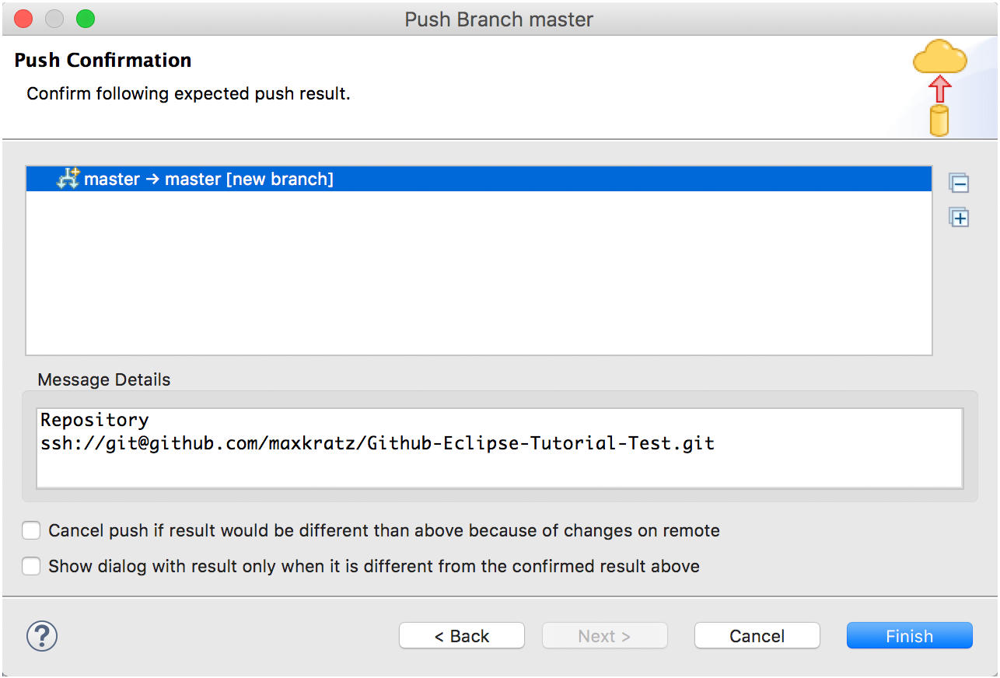  

* Eclipse prompts you with a message that the data is pushed.
* Click **OK**.

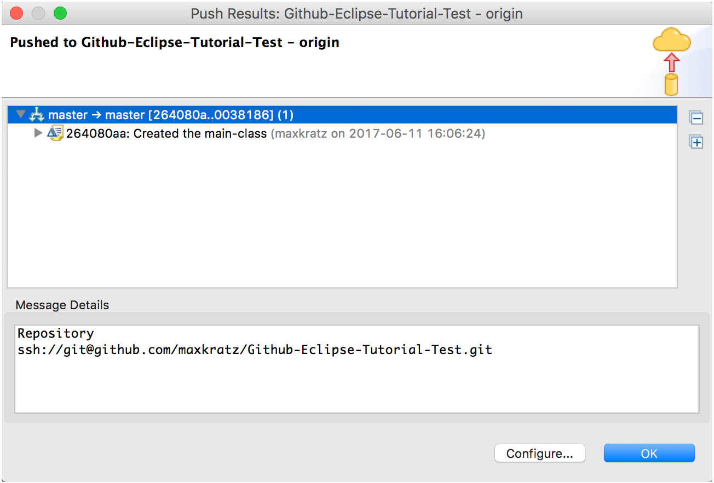

## The end

The upload of your project to GitHub is finished.
You can now open the repository on GitHub and check your source files.

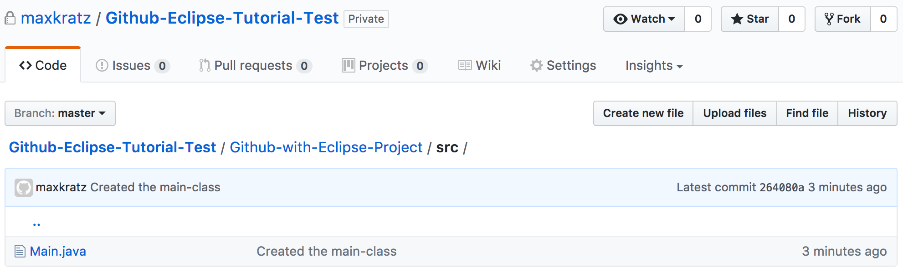

## References

- [Max Rohde - Eclipse and GitHub Tutorial](https://maxrohde.com/2012/05/25/eclipse-and-github-tutorial/)  
- [Git with Eclipse (EGit) – Tutorial](http://www.vogella.com/articles/EGit/article.html)  
- [Getting Started with Git, EGit, Eclipse, and GitHub](http://jeromyanglim.blogspot.co.nz/2010/11/getting-started-with-git-egit-eclipse.html)  
- [git push rejected (on stackoverflow)](http://stackoverflow.com/questions/620253/git-push-rejected)  
- [A Short Tutorial on Eclipse/EGit/GitHub](http://npascut1.wordpress.com/2011/03/10/eclipseandgit/)  
- [Using the EGit Eclipse Plugin with GitHub](http://loianegroner.com/2009/11/tutorial-using-the-egit-eclipse-plugin-with-github/)

## License

This project is licensed under the GNU General Public License v3.0 - see the [LICENSE](LICENSE) file for more details.
